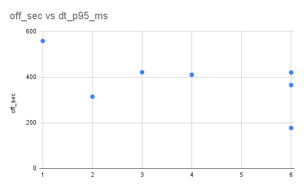
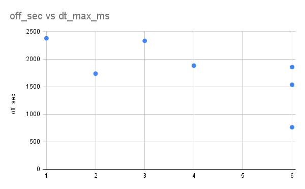
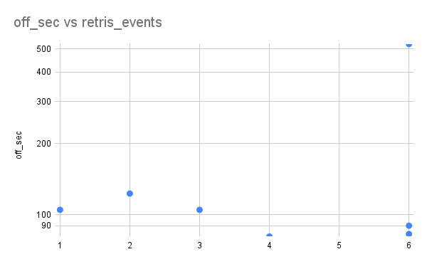

DAY 4 NOTES – Idle Window Collapse and Queue Persistence

hypothesis
----------
As the OFF window between IO bursts shrinks, the system loses its ability to drain internal queues and return to an idle state.
Below a critical OFF duration, IO queues persist across bursts, retry amplification becomes continuous rather than episodic,
and scheduler timing no longer fully recovers between load events.

This transition will be observable as:
- Increased heartbeat tail latency
- Increased frequency of scheduler exceedances
- Reduced or vanished recovery gap between intervention events
- A non-linear “knee point” where small reductions in OFF time produce disproportionate instability

experimental structure
---------------------

Day 4 was designed as a controlled parameter sweep over the OFF window
between aligned IO bursts. All interference mechanisms and system
conditions were held constant, while only the idle duration separating
bursts was varied.

This isolates the effect of recovery time on system stability and
allows direct observation of the transition from transient load
deformation to structural collapse behavior.

constant parameters
------------------
- Burst ON duration: 3 seconds
- Number of bursts: 50
- FIO workload:
  - randwrite, 4K blocks
  - iodepth = 16
  - direct IO enabled
  - Target file on SD-backed root filesystem
- Retry storm:
  - BUDGET_MS = 120
  - RETRIES = 3
  - Continuous retry amplification on threshold exceedance
- Heartbeat:
  - Sampling interval = 100 ms

sweep parameter
--------------
OFF window (seconds between bursts):
6, 4, 3, 2, 1

Each run consisted of three distinct phases:

1. Baseline phase (60s)
   System idle, heartbeat only.

2. Intervention phase (180s)
   Repeated burst pattern:
   - 3 seconds IO burst
   - OFF seconds idle
   - Retry storm active

3. Recovery phase (120s)
   All interference stopped, heartbeat only.

experimental calibration note
-----------------------------
Early Day 4 attempts used overly aggressive retry amplification
parameters. In this regime, the system transitioned directly into a
persistent retry storm without passing through a recoverable state.
This prevented observation of the recovery-to-collapse transition and
masked the collapse knee. The sweep was therefore recalibrated to reduce
retry aggressiveness and allow the transition region to become visible.

results
--------

Figure 1 shows that extreme scheduler tail latency (p99) increases discontinuously
as OFF windows shrink. Multiple points at identical OFF values indicate bifurcation,
where the system alternates between stable and collapse-dominated behavior.

figure 2 shows that moderate tail latency (p95) increases gradually, 
while extreme tail latency (p99) undergoes sharp destabilization, 
indicating collapse begins at the far tail before affecting the bulk scheduler behavior.

Figure 3 shows rare but severe scheduler exceedances that appear discontinuously 
once recovery windows shrink, marking entry into a collapse-dominated regime.

Retry behavior becomes bifurcated. The same OFF value can produce either a stable regime or a retry-dominated collapse regime.
This figure shows that retry amplification does not grow monotonically as OFF decreases.
Instead, the system enters a bifurcation regime where identical OFF values produce qualitatively different behaviors:
a stable low-retry regime and a collapse-dominated retry storm regime.
This indicates loss of deterministic recovery and emergence of state-dependent dynamics.
Figure 4 shows retry amplification does not grow linearly with load. Instead, 
it exhibits bifurcation behavior and saturation, characteristic of nonlinear feedback systems approaching collapse.

interpretation
--------------

Day 4 demonstrates that system collapse is governed not by load magnitude,
but by recovery opportunity. As the OFF window between bursts shrinks, the
system loses its ability to return to a stable baseline state.

The transition is not gradual. Instead, a bifurcation regime emerges in which
identical experimental conditions produce either stable or collapse-dominated
behavior. This loss of determinism marks the breakdown of structural recovery.

Collapse first manifests in the extreme tail of scheduler latency distributions.
While p95 increases modestly, p99 and maximum latency grow discontinuously,
indicating that collapse is born in rare scheduling failures before spreading
to bulk system behavior.

Retry amplification exhibits the same nonlinear structure. Retry events do not
increase monotonically with load but show bifurcation and saturation,
characteristic of feedback-driven collapse dynamics.

These observations confirm that collapse is not a function of volume,
but of timing: once idle windows shrink below the system’s internal drainage
capacity, queues persist, retries overlap, and recovery becomes statistically
unstable rather than guaranteed.

conclusion
----------

Day 4 shows that collapse is a timing failure, not a capacity failure.

Systems do not collapse because they are overloaded,
but because they are denied sufficient recovery time to reestablish
structural equilibrium.

The OFF window acts as a phase boundary between elastic stability and
collapse-dominated behavior. Below a critical threshold, recovery ceases to
be deterministic and collapse becomes an intrinsic property of the system’s
dynamics.
